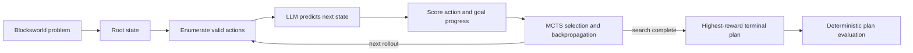

# Reasoning via Planning for Agentic AI
Exercise 3 for the Agentic AI course at the University of Bielefeld

An implementation and evaluation of **Reasoning via Planning (RAP)**: a search-augmented approach that uses a large language model as a world model and Monte Carlo Tree Search (MCTS) to solve multi-step planning problems.

The project reproduces RAP-style reasoning on Blocksworld with `Qwen3-VL-4B`, compares it with a direct-LLM baseline, and evaluates every generated plan using a deterministic simulator. It was developed by **Cono Cirone and Esther Giuliano** for the Agentic AI Seminar, Summer Semester 2026, at Bielefeld University.

[View the tutorial slides](docs/AGAI%203.%20tutorial.pdf)

## Why RAP?

LLMs normally generate an answer left to right in a single pass. On long-horizon tasks, that makes it difficult to look ahead, recognize dead ends, or compare competing action sequences.

RAP reframes reasoning as planning over a search tree:

- A **node** represents a predicted world state and stores its reward.
- An **edge** represents an action taken from that state.
- The **reasoner** proposes or enumerates possible next actions.
- The **world model** predicts the state produced by an action and estimates its usefulness.
- **MCTS** balances exploitation of promising plans with exploration of alternatives.



## How the implementation works

Each MCTS rollout performs three stages:

1. **Select** - descend through the tree using the Upper Confidence Bound for Trees (UCT).
2. **Expand** - generate valid actions, predict their resulting states, and create child nodes.
3. **Backpropagate** - update visit counts and reward statistics along the selected path.

The UCT score combines the best reward observed through a node with an exploration bonus:

```text
UCT(v) = M(v) + w_exp * sqrt(ln N(parent) / N(v))
```

where `M(v)` is the best cumulative reward seen through node `v`, `N(v)` is its visit count, and `w_exp = 1.0` controls exploration. Unvisited nodes receive a dedicated exploration bonus.

The reward combines action quality and progress toward the goal:

```text
r(s, a) = r0(s, a)^alpha * r1(s, a)^(1-alpha),  alpha = 0.5
```

- `r0` measures whether the transition is promising.
- `r1` measures how many goal conditions the predicted state satisfies.
- Complete goal satisfaction produces a terminal success reward.

### Adapting RAP to chat APIs

The original RAP implementation uses next-token log-likelihoods from a locally hosted LLaMA model. Standard chat APIs do not expose raw logits, so this project replaces that signal with an explicit LLM judgement:

```text
Is the resulting state closer to the goal?
Yes -> 0.9
No  -> 0.1
```

This approximation makes the experiment portable to OpenAI-compatible endpoints through AgentScope, while preserving the central search-and-world-model design. It is also an important experimental limitation: the scores are coarse judgements rather than calibrated token probabilities.

## Evaluation

### Dataset

The benchmark contains four-block PDDL planning problems at three difficulty levels:

| Split | Instances | Ground-truth plan length | Difficulty |
| --- | ---: | ---: | --- |
| `step_2` | 30 | 2 actions | Easy |
| `step_4` | 57 | 4 actions | Medium |
| `step_6` | 114 | 6 actions | Hard |

### Methods compared

| Method | Strategy |
| --- | --- |
| Direct-LLM baseline | Four few-shot examples followed by one-shot plan generation |
| RAP-MCTS | Ten search rollouts using state prediction and action scoring |

A generated plan counts as successful only when a deterministic simulator confirms both conditions:

1. Every action is legally applicable and violates no Blocksworld precondition.
2. The final simulated state satisfies every requested goal condition.

### Results

Recorded results using `Qwen/Qwen3-VL-4B-Instruct-FP8`:

| Split | Direct baseline | RAP-MCTS | Absolute gain |
| --- | ---: | ---: | ---: |
| `step_2` (`n=30`) | 66.7% | **100.0%** | **+33.3 pp** |
| `step_4` (`n=57`) | 28.1% | **63.2%** | **+35.1 pp** |
| `step_6` (`n=114`) | 1.7% | **5.3%** | **+3.5 pp** |

RAP substantially improves performance on the short and medium planning tasks. Both methods degrade on six-step problems, showing that search helps but does not fully overcome errors in long-horizon state prediction and coarse action scoring. The full per-instance outputs are available in [`exercise_3/results/`](exercise_3/results/).

## Repository structure

```text
.
├── README.md
├── example.py                 # Minimal AgentScope chat agent
├── embedding_example.py       # AgentScope embedding and chat example
├── docs/
│   └── AGAI 3. tutorial.pdf   # Technical presentation
├── exercise_3/
│   ├── run.py                 # Experiment CLI and result persistence
│   ├── config.py              # Shared paths and model identifiers
│   ├── world_model.py         # LLM state prediction and action scoring
│   ├── mcts_node.py           # Search node, reward, and expansion logic
│   ├── mcts.py                # Selection and backpropagation
│   ├── search.py              # End-to-end RAP search orchestration
│   ├── baseline.py            # Direct-LLM planning baseline
│   ├── utils.py               # PDDL parser and deterministic simulator
│   ├── RAP/                   # Upstream RAP code and benchmark data
│   └── results/               # Recorded JSON experiment results
└── tests/
```

## Getting started

### Requirements

- Python 3.13 or newer
- [`uv`](https://docs.astral.sh/uv/)
- An OpenAI-compatible LLM endpoint

### Installation

```bash
git clone https://github.com/esthy13/rap-agai.git
cd rap-agai
uv sync --extra dev
```

Create `.env` in the repository root:

```dotenv
LLM_API_KEY=your_api_key
LLM_BASE_URL=https://your-endpoint.example/v1
```

The `.env` file is ignored by Git and must never be committed.

## Running experiments

Run RAP and the baseline on five easy problems:

```bash
uv run python -m exercise_3.run --steps 2 --n 5
```

Run one method or change the search budget:

```bash
# RAP only
uv run python -m exercise_3.run --steps 4 --n 10 --no-baseline

# Baseline only
uv run python -m exercise_3.run --steps 6 --n 10 --no-rap

# More rollouts and a deeper search tree
uv run python -m exercise_3.run --steps 6 --n 10 --rollouts 20 --depth 6
```

### CLI reference

| Option | Default | Description |
| --- | ---: | --- |
| `--steps` | `2` | Dataset difficulty: `2`, `4`, or `6` actions |
| `--n` | all | Maximum number of instances to evaluate |
| `--rollouts` | `10` | MCTS rollouts per problem |
| `--depth` | `4` | Maximum MCTS plan depth |
| `--no-rap` | off | Skip RAP-MCTS |
| `--no-baseline` | off | Skip the direct-LLM baseline |
| `--output` | generated path | Custom JSON output path |

Results are saved incrementally after every problem, so completed work survives an interrupted run. Each JSON file contains the experiment configuration, aggregate accuracies, ground-truth actions, generated plans, and per-method correctness.

## Development

```bash
uv run ruff check .
uv run pytest
```

GitLab CI runs linting, tests, and API-documentation generation.

## Skills demonstrated

Python · asynchronous LLM APIs · AgentScope · agentic reasoning · Monte Carlo Tree Search · world models · PDDL · automated planning · prompt engineering · baseline design · deterministic evaluation · experiment tracking · CI/CD

## Reference and attribution

This project is based on:

> Shibo Hao, Yi Gu, Haodi Ma, Joshua Jiahua Hong, Zhen Wang, Daisy Zhe Wang, and Zhiting Hu. “Reasoning with Language Model is Planning with World Model.” EMNLP 2023. [arXiv:2305.14992](https://doi.org/10.48550/arXiv.2305.14992).

The bundled upstream RAP implementation retains its original license in [`exercise_3/RAP/LICENSE`](exercise_3/RAP/LICENSE). The tutorial presentation was created for the Agentic AI Seminar at Bielefeld University.

## License

See [`LICENSE`](LICENSE) for this repository's license terms.
